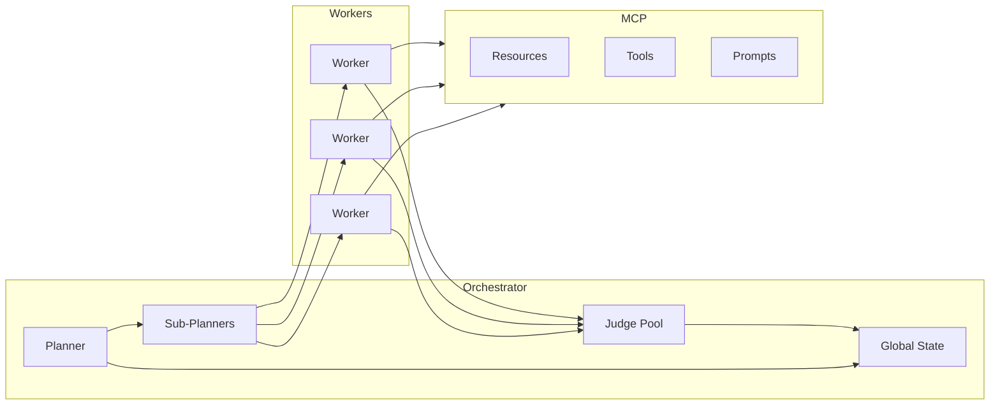
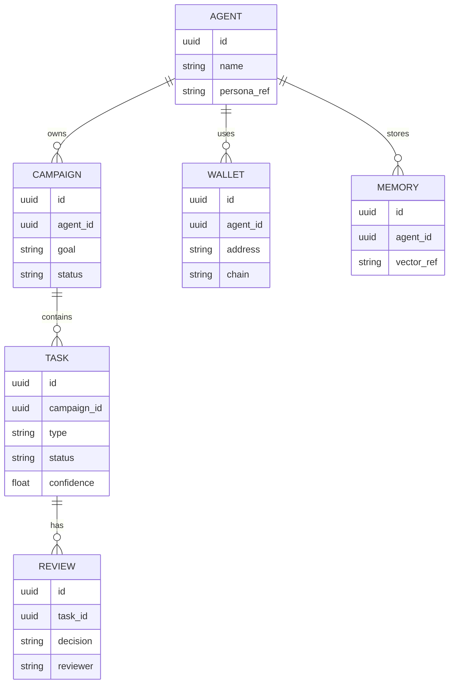

# Architecture Strategy

Date: 2026-02-04

## Summary
This document defines the initial architecture decisions for Project Chimera to enable spec-driven, governed autonomy.

## Agent Pattern
**Selected pattern:** Hierarchical Swarm (Planner → Sub-Planners → Worker Pool → Judge Pool)

**Rationale:**
- Scales task throughput while keeping orchestration centralized.
- Supports dynamic re-planning on failures or context shifts.
- Enables specialized Judges (e.g., CFO Judge) for governance.

## Human-in-the-Loop (Safety Layer)
HITL is required when:
- Confidence < 0.7 on any Worker output.
- Sensitive topics are detected (politics, health, finance, legal claims).
- Any action triggers external side effects (publishing, transactions).

HITL is optional (async approval) when confidence is 0.70–0.90, with queue-based review.

## Data Persistence Strategy
**Transactional:** PostgreSQL for campaigns, tasks, approvals, audit logs.

**Semantic:** Weaviate for persona memory and long-term recall.

**Cache/Queue:** Redis for task queues and short-term episodic memory.

**Ledger:** On-chain storage for transaction audit and immutable records.

## System Topology (Mermaid)

## Database Schema Direction (ERD)

## Open Questions
- Define the exact schema for Task and Review payloads in specs/technical.md.
- Confirm per-platform AI disclosure requirements and integrate into publishing schema.
